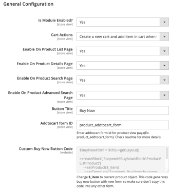
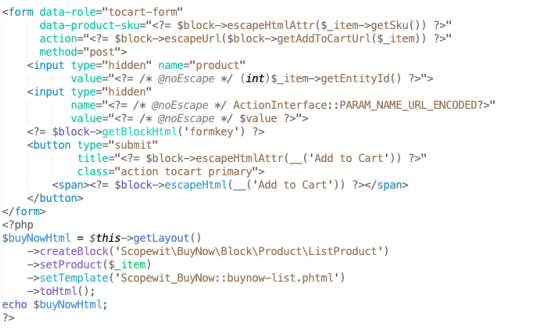
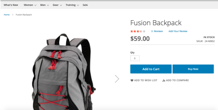
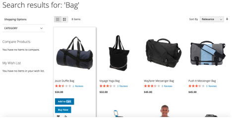

<strong>Mdbhojwani_BuyNow</strong> 

## Table of contents

- [Summary](#summary)
- [Installation](#installation)
- [Configurations](#configurations)
- [License](#license)

## Summary

This module add "Buy Now" button on Product Listing Page, Search Result Page, Product View Page to process directly checkout.


## Installation

```
composer require mdbhojwani/magento2-buy-now
bin/magento module:enable Mdbhojwani_BuyNow
bin/magento setup:upgrade
bin/magento setup:di:compile
bin/magento setup:static-content:deploy -f
bin/magento cache:clean
bin/magento cache:flush
```

## Configurations

```
1. Login to Magento Backend
2. Navigate to Stores > Configurations > Mdbhojwani > Buy Now
```



### Cart Actions
1. Remove all cart item(s) when Click Buy Now.
 - This setting will remove all cart items and add new item in cart when click on “Buy Now” button.
2. Keep other cart's item(s) when Click Buy Now.
 - This setting will keep other cart items and add new item in cart when click on “Buy Now” button.
3. Create a new cart and add item in cart when Click Buy Now.
 - This setting will create new cart add new item in the cart when click on “Buy Now” button. Once order placed  restore previous cart.


### Use below code to add "Buy Now" button in custom place.

``````
$buyNowHtml = $this->getLayout()
    ->createBlock('Mdbhojwani\BuyNow\Block\Product\ListProduct')
    ->setProduct($_item)
    ->setTemplate('Mdbhojwani_BuyNow::buynow-list.phtml')
    ->toHtml();
echo $buyNowHtml;
``````
<b>Change `$_item` to current product object.</b>

You can use above code where you want to show "Buy Now" button against the product. Please make sure don't copy this code to addtocart or any other form. Put this code after any `</form>`. Here is the screenshot of sample code of usage



### Frontend View

- PRODUCT DETAIL PAGE

    

- PRODUCT LIST PAGE

    

- PRODUCT SEARCH PAGE

    

### Notice

We don't support "Buy Now" button on product widegets, related, upsell, wishlist or any other places because it needs override core phtml files which is not the recommended solution. Please keep in note that most of the paid or free version of the Buy Now module overrides the core phtml files.

## License

[Open Software License ("OSL") v. 3.0](https://opensource.org/license/osl-3-0-php)

